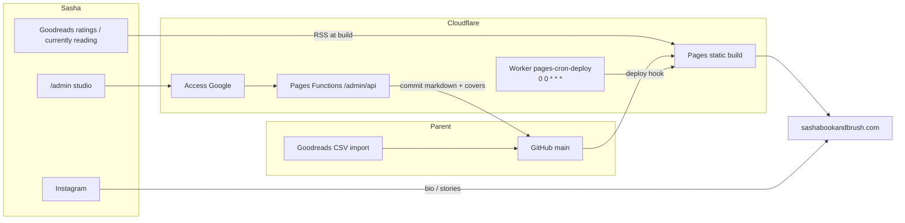
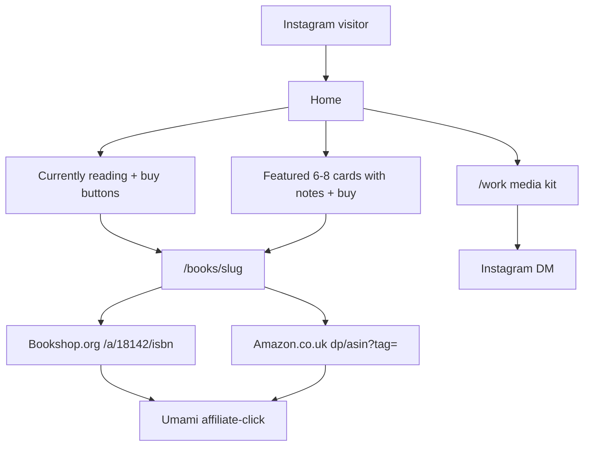
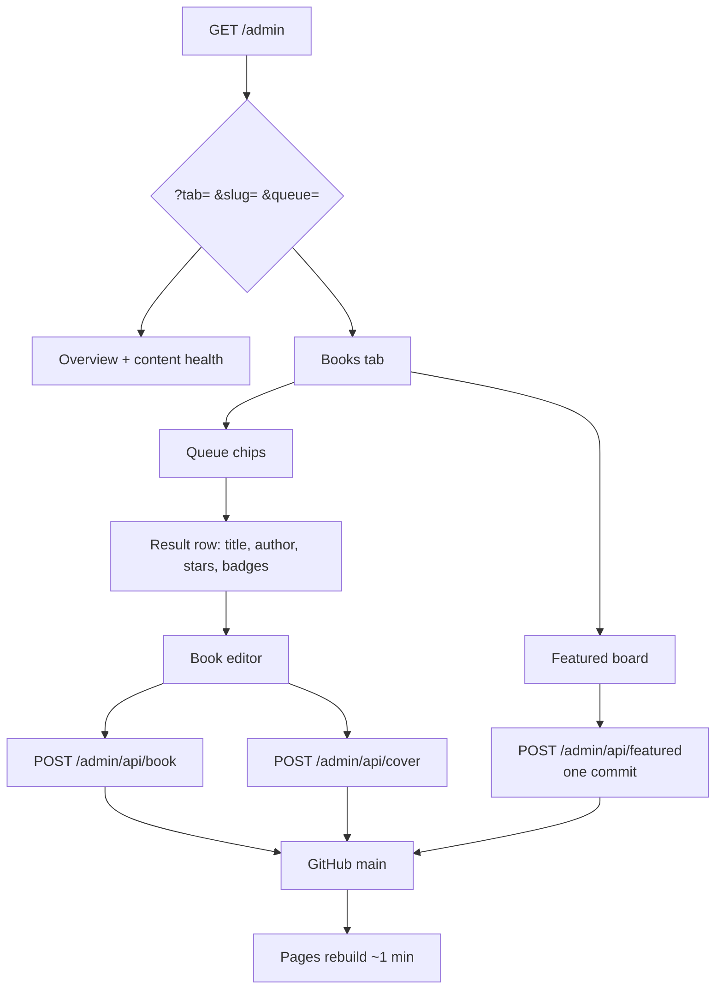

# sashabookandbrush conversion and studio-editor improvement plan

| Field | Value |
| --- | --- |
| **Title** | sashabookandbrush conversion and studio-editor improvement plan |
| **Author** | TBD (parent / maintainer) |
| **Date** | 2026-09-13 |
| **Status** | Draft |
| **Site** | https://sashabookandbrush.com |
| **Audience** | Parent who maintains the tech. Sasha (@sashabookandbrush, ~3,060 Instagram followers) is the creator and uses `/admin` as a studio, not a CMS. |
| **Related** | [Plan.md](Plan.md), [WebsiteBuildPlan.md](WebsiteBuildPlan.md), [README.md](README.md) |

---

## Overview

The site is live and the engineering is ahead of the monetization. 273 Goodreads-imported books already sit behind Astro content collections, Cloudflare Pages, a Google-gated `/admin`, and working Amazon/Bookshop IDs (`sashabookandb-21`, `18142`). What is missing is the shop-window behaviour: high-intent recs with honest buy buttons, UK-compliant disclosure, click tracking, a work-with-me page brands can actually use, and a studio editor that surfaces the handful of books that need a note or a home card.

This plan does **not** grow the library, add a database, or turn `/admin` into a CMS. It is a sequenced implementation plan: fix live trust bugs (dead `#` Amazon buttons, untagged footer Bookshop URL, missing disclosure), put Bookshop-primary buy buttons on currently reading, hide the empty Shop nav item, turn `/work` into a media kit, then upgrade the studio so Sasha can find “five-star, no note” without searching 273 titles. Content notes remain Sasha’s job; the editor only queues them.

---

## Background & Motivation

**Operating principle (unchanged):** Goodreads is the diary. This site is the shop window. She rates and logs progress on Goodreads. The site does not write back. Money at 3k Instagram comes from high-intent recs — currently reading, five-star romantasy, whatever she just posted — not from browsing 273 titles.

Revenue mix from `Plan.md`:

| Stream | Near-term | Why it is first |
| --- | --- | --- |
| Affiliates (Bookshop.org UK primary, Amazon.co.uk secondary) | $50–150/mo stretch | IDs are live; buttons are not on the hottest shelves |
| Paid / gifted collabs | 1–3 deals/mo | `/work` is Instagram-only even though `site.json` already has `offers` / `packages` / `credentials` / `stats` |
| Digital products | Later | `/shop` is a placeholder; keep the URL, hide the nav |

### Current state, verified in repo (2026-09-13)

| Fact | Evidence |
| --- | --- |
| 273 books, **31 with a public note**, **4 featured**, **108 five-star**, **39 missing ISBN**, **5 currently-reading** | `src/content/books/*.md` |
| Featured set (all have notes): Wild Reverence (`order: 1`), ACOMAF (`2`), Fourth Wing (`3`), Evelyn Hugo (`4`) | those four files, `featured: true` |
| Currently reading: ACOWAR, Crown of Midnight, The Last Witch, The Secret Paris Ingredient, Wild Card | `status: "currently-reading"` |
| 91 five-star books have no note | rating 5 and empty `note` |
| All 4 supplies use `amazon: "#"` | `src/content/supplies/*.md` |
| Art: 5 pieces; `the-mountains-of-velaris.md` has empty note and no `image`; Frodo and Girl in turmoil have images but empty notes | `src/content/art/` |
| Affiliate IDs live | `src/data/site.json` `affiliates.amazonTag` / `bookshopUkId` |
| Footer Bookshop is the generic homepage | `site.bookshop` = `https://uk.bookshop.org` |
| Shop is in public nav | `site.nav` last item `{ href: "/shop", label: "Shop" }` |
| `/work` ignores `offers`/`packages`/`credentials`/`stats` | `src/pages/work.astro` is Instagram CTA only |
| Umami pageviews exist; no affiliate click events | `BaseLayout.astro` loads `analytics.kwokah.com`; no `data-umami-event` anywhere |
| Cloudflare Access for `/admin` is already set up | Do **not** treat Access / Google login / `CF_ACCESS_*` as remaining work |
| Live rebuild Worker cron is **daily** `0 0 * * *` on Worker **`pages-cron-deploy`** | Confirmed via Cloudflare API 2026-09-13 |
| Repo still documents 6-hourly | `workers/rebuild-pages/wrangler.toml` `crons = ["0 */6 * * *"]`, Worker `name = "sashabookandbrush-rebuild"` |

### Pain points (public)

1. **Live bug — dead supply buttons.** `SupplyButtons.astro` always renders `<a href={amazon}>`. Every supply’s `amazon` is `"#"`. Featured Liquitex and Princeton cards on Home and Art therefore ship a broken Amazon button. `functions/admin/api/supply.js` `affiliateValue()` writes `"#"` for a blank field, so the studio re-creates the bug.
2. **Footer Bookshop is untagged.** `Footer.astro` uses `site.bookshop`. Per-book links correctly go to `https://uk.bookshop.org/a/18142/{isbn}` via `affiliateLinks()` in `src/lib/affiliates.ts`. The footer does not.
3. **Disclosure is footer-only.** UK CAP/CMA wants the affiliate nature obvious next to the commercial prompt, not only in the page footer. `rel="sponsored noopener noreferrer"` is already correct on the buttons.
4. **Hottest shelves have no buy buttons.** Home featured cards pass `showBuy` into `BookCard.astro`. The currently-reading block in `src/pages/index.astro` is a cover+title `<a>` with no `AffiliateButtons`. `CoverWall.astro` (five-star wall + series stacks) is cover-only, which is the right call for 108 spines — but currently-reading is five books and should sell.
5. **Hero CTA sends IG traffic into the full library.** Primary button is “Browse books →” `/recommendations`. Currently reading is the next section on the same page and has no `id` to jump to.
6. **`/work` is not a media kit.** Brands who click it see a paragraph and an Instagram button. The packages already written in `site.json` never render.
7. **Brand chrome disagrees with itself.** `site.brand` is `"sasha & brush"` (used in `<title>` / OG title). Wordmark in `Logo.astro`, `og:site_name`, and `site.webmanifest` is `SashaBook&Brush`.
8. **Book OG images ignore the cover.** `src/pages/books/[slug].astro` does not pass `image` to `BaseLayout`, so every book shares `/images/og-default.png`.
9. **Winsor & Newton is spelled Windsor** in `src/content/supplies/windsor-newton-galeria-acrylic.md` (title and brand). Leave the filename/slug; it is not a public route.

### Pain points (studio)

`src/pages/admin.astro` is a single ~1158-line Astro page (markup + `define:vars` script). It works. It does not help Sasha do her actual jobs.

- Books tab is search-only: min 2 chars, 40 results, title/author/slug. No queue for currently-reading, featured, five-star-without-note, no-note, missing-ISBN.
- Result rows have no rating, note-empty badge, or featured badge.
- Featured is a per-book checkbox. `order` exists on the book schema (`src/content.config.ts` line 17) and is how Home already sorts featured (`index.astro` lines 16–18), but `functions/admin/api/book.js` never writes `order` and the book editor has no order field (art/tools do).
- After save, status says wait ~1 minute for rebuild. No “View on site” link to `/books/<slug>`.
- `fillBook()` calls `resetDrop("book", "", …)` with an empty preview src, so the existing cover never shows. Art already previews via `piece.imageUrl` from an `import.meta.glob`.
- Save has no loading/disabled state and no `beforeunload` unsaved guard.
- Tab is not in the URL. `showApp()` always `setTab("overview")`.
- Overview stats are build-time counts (featured, book total) plus live `/admin/api/activity`. No content-health: notes coverage, invalid supply URLs, art missing images.
- CSV import is correctly buried under Advanced. Keep it there.

---

## Goals & Non-Goals

### Goals

1. Make every public buy button either a real `https://` URL or absent. Never `#`.
2. Put UK-compliant affiliate disclosure next to buy buttons; keep the footer Associates copy.
3. Put Bookshop-primary / Amazon-secondary buttons on **currently reading** (home). Leave the 273-row library as click-through.
4. Track affiliate clicks in the existing Umami property (`data-umami-event`), no new vendor.
5. Hide Shop from public nav until products exist; keep `/shop`.
6. Turn `/work` into an on-page media kit from existing `site.json` fields. Instagram DM stays the CTA.
7. Treat featured as a rotating 6–8 slot with real notes, not a project to annotate 273 books.
8. Give Sasha work queues and a featured board in `/admin` so she can write a note, star a home card, drop a cover, add a painting, or add a tool with a real Amazon URL — without learning Git.
9. Parent-only: CSV, rebuild status, affiliate URL overrides, ISBN gaps, cron-doc drift, keeping `scripts/admin-server.mjs` aligned with Pages Functions.

### Non-goals (this plan)

- Blog, newsletter / email list (one-line later item only), Linktree, custom shop/CMS.
- Growing the Goodreads import or writing 240 notes in code.
- Database, SPA framework, splitting `admin.astro` into React/Svelte.
- Site-copy CMS for hero/about in `site.json`.
- Letting Sasha **create books** in admin (CSV/Goodreads remains intake). Art and tools create/delete stay.
- Cloudflare Access, Google login, `CF_ACCESS_*` env vars, locking `/admin`.
- Switching the live cron back to 6-hourly.
- Rewriting the stack (Astro 5 + Tailwind 4 + Pages Functions + GitHub commits stays).

### Later, one line each

- Email list (ConvertKit free tier) once there is a reason to collect addresses beyond the unused Shop waitlist.
- Downloadable one-page media kit PDF once `/work` copy is stable.
- Bookshop.org curated list URL for the five-star shelf, if Sasha creates one.
- Digital products on `/shop` (Gumroad/Etsy); then restore the nav item.

---

## Key Decisions

1. **Do not grow the library; merchandise a short window.** Home currently-reading (5 books) and a 6–8 featured slot with notes are the conversion surface. The 273-row library and 108-cover five-star wall stay browse → book page. Rationale: affiliate income at this size is high-intent, not catalogue-wide. Adding 273 buttons would be noise on mobile and a disclosure/layout problem.

2. **Bookshop primary, Amazon secondary, same helper everywhere.** `affiliateLinks()` in `src/lib/affiliates.ts` is the single builder (override URL, else ISBN + `site.affiliates`). Export `realUrl()` and use it in **both** `AffiliateButtons.astro` and `SupplyButtons.astro` so `#` / empty never render. Persist empty the same way in `functions/admin/api/book.js`, `supply.js`, and `scripts/admin-server.mjs` via one `emptyAffiliateUrl()` helper (blank or `#` → `""` → field omitted). Rationale: IDs are already live; the bug is rendering and the `#` sentinel, not account setup.

3. **Five-star wall does not get per-cover buy buttons.** Tap cover → `/books/<slug>`. Optional later: one “Shop this shelf on Bookshop.org” link **outside** `CoverWall`’s `<ul>` if a list exists. Rationale: `CoverWall.astro` is `grid-cols-4 sm:grid-cols-6 md:grid-cols-8` × 108 covers, each spine already an `<a href={bookHref}>` — nested buy links would be invalid HTML and unusable on a phone. Currently-reading (5 cards) *does* get buttons, on a **wider grid** with **dark-tone** chips (Bookshop is `bg-secondary` today; the shelf is also `bg-secondary` / `#3d5246`, so light-theme chips would vanish). One section-level disclosure, not five copies.

4. **Footer Bookshop default: tagged affiliate root, not a branded shop slug we do not have.** Recommend `https://uk.bookshop.org/a/18142` in `site.bookshop` until Sasha has a shop slug or a curated list. Per-book links stay `/a/18142/{isbn}`. This is an open question; see below.

5. **`/work` ships HTML first, PDF later.** Render `workIntro`, `stats`, `offers`, `packages`, `credentials` from `site.json`. CTA remains `site.instagram`. Under packages, exact sentence: **“Rates on request via Instagram.”** No prices in `site.json`. A Canva/A4 PDF is a follow-up once the on-page copy is the source of truth. Rationale: collabs likely out-earn affiliates at 3k; the page is currently empty of the data already written.

6. **No `site.json` CMS in v1.** Hero/about copy stays in git. Featured merchandising is book frontmatter (`featured` + `order`), which the studio already edits. Overview may show “featured: N / target 6–8” as a build-time health stat, not a copy editor.

7. **Keep `/admin` a studio: one Astro page, Pages Functions, GitHub commits — and the local twin.** UX changes in `admin.astro` + small API additions. `npm run admin` serves `scripts/admin-server.mjs` at `PUBLIC_ADMIN_URL` (`http://127.0.0.1:8787`); that file **reimplements** `/api/book`, `/api/supply`, `/api/art` rather than loading Pages Functions. Every Function change in this plan has a matching `admin-server.mjs` change. Do not introduce a frontend framework. Optional later: extract the `define:vars` script to `src/pages/admin-app.js` if the file becomes painful; that is not a prerequisite.

8. **Featured reorder is one GitHub commit, as a patch, not a snapshot.** Home already sorts featured by `book.data.order`. Wire `order` in the book editor (assign `max(featured.order)+1` when starring) and a featured board. Batch-write via `POST /admin/api/featured`: listed slugs only; unfeature writes `featured: false` and **does not touch `order`**; feature/reorder writes dense `1…N` only on `featured: true` rows in the payload. Cap 20. Unknown slug → 400, no commit. Local `admin-server.mjs` does the same as several file writes + one activity line.

9. **Books are not created in admin.** Goodreads CSV (Advanced) remains intake. Art and tools keep New/Delete.

10. **ISBN is visible and editable for the parent; generated buy URLs are read-only.** Open question 5, recommended (A). Sasha’s job is the note. The 39 missing ISBNs are a parent data-fix, and the missing-ISBN queue is how she (or the parent) finds them without git. Generated Bookshop/Amazon URLs are computed with the same `affiliateLinks()` / `previewBuy()` rules and are not typed in by hand unless a special-edition override is needed (those override fields already exist).

11. **Brand chrome follows the wordmark.** Change `site.brand` from `"sasha & brush"` to `"SashaBook&Brush"` so `<title>` / `og:title` match `Logo.astro`, `og:site_name`, and `site.webmanifest`. Handle stays `@sashabookandbrush`. This is an open question with a recommended default.

12. **Cron: make git match live; do not deploy a second Worker.** Live Worker is `pages-cron-deploy` with `0 0 * * *`. Repo file is `sashabookandbrush-rebuild` with `0 */6 * * *`. Update `wrangler.toml` `name` and `crons` to the live values so the next intentional `wrangler deploy` updates the existing Worker instead of creating a duplicate. Do not go back to 6-hourly.

13. **Cover OG uses Astro `getImage()`, not a second copy in `public/`.** Book covers live in `src/assets/covers/` and are already in the image pipeline via `CoverImage.astro`’s glob + `filename = cover.split("/").pop()` (this is why `cover: "/images/covers/acomaf.jpg"` still resolves to `src/assets/covers/acomaf.jpg`). Extract that match as `coverModule()` returning `ImageMetadata | undefined`. Pass the processed `/_astro/…` URL into `BaseLayout` `image`, **and** pass the processed width/height so `og:image:width` / `height` are not left as the hardcoded 1200×630 that today assumes `og-default.png`. Fallback remains `site.share.image` at 1200×630. No composite 1.91:1 template in this plan.

14. **Cloudflare Access is done.** This plan never lists Access, Google login, or `CF_ACCESS_*` as tasks.

---

## Proposed Design

### Architecture (unchanged)



Content stays markdown collections + `src/data/site.json`. No database. Rebuilds remain “save → GitHub commit → Pages build ~1 min”.

### Conversion funnel (what we are actually building)



Library (`/recommendations` row cards) and five-star wall stay “tap through to the book page”, not 273 competing CTAs.

---

### 1. Public site — trust and conversion

#### 1.1 Dead supply buttons (live bug)

**Today**

- `realUrl()` in `src/lib/affiliates.ts` already treats `""` and `"#"` as empty, but it is **not exported**, and `SupplyButtons.astro` does not use it.
- `SupplyButtons.astro` always emits the Amazon `<a href={amazon}>`.
- `functions/admin/api/supply.js`:

```7:10:functions/admin/api/supply.js
function affiliateValue(value) {
  const trimmed = String(value || "").trim();
  return !trimmed || trimmed === "#" ? "#" : trimmed;
}
```

- Schema requires `amazon: z.string()` (`src/content.config.ts` lines 43–56).

**Change**

1. Export `realUrl` from `src/lib/affiliates.ts`. Use it in **both** `AffiliateButtons.astro` and `SupplyButtons.astro` (hide a link unless `realUrl` accepts it).
2. `SupplyButtons.astro`: render Amazon only if `realUrl(amazon)`; render `shop` only if `realUrl(shop)`. If neither, render no button row (disclosure is omitted too).
3. Add `emptyAffiliateUrl()` next to `applyYamlFields` in `functions/admin/api/_lib/frontmatter.js`: blank or `"#"` → `""`. Import it from `book.js`, `supply.js`, and `scripts/admin-server.mjs` (that file already imports `./_lib/photo.js`; it currently has its own `affiliateValue` at line 115 that only `.trim()`s — it does **not** write `#`, but it also does not treat `#` as empty).
4. `applyYamlFields` already **removes** a field when the value is `""` (`frontmatter.js` lines 20–22). That is the **update** path.
5. **Create** path: `supplyMarkdown()` in `supply.js` (and the matching template string in `admin-server.mjs` ~lines 426–435) always emits `amazon: ${yamlString(amazon)}`. If `amazon` is empty, **skip that line** (same as `shop` is already omitted). Do not write `amazon: ""`.
6. Schema: `amazon: z.string().optional().default("")`.
7. Clean the four existing files (`liquitex-basics.md`, `princeton-brushes.md`, `sketchbook.md`, `windsor-newton-galeria-acrylic.md`) by deleting `amazon: "#"`.
8. Same PR: spelling **Winsor & Newton** in title + brand of `windsor-newton-galeria-acrylic.md`. Do **not** rename the slug.

Home featured tools (Liquitex, Princeton) currently advertise a dead button. After this PR they show note-only until a real Amazon URL is pasted in `/admin`.

#### 1.2 Footer Bookshop URL

`Footer.astro` already binds `href={site.bookshop}`. Change the value in `src/data/site.json`.

**Recommended default (pending open question):**

```json
"bookshop": "https://uk.bookshop.org/a/18142"
```

Do not invent a shop slug. If Sasha later has `https://uk.bookshop.org/shop/<slug>`, swap this one field. Footer Bookshop should also get `rel="sponsored noopener noreferrer"` once it is an affiliate URL, plus the same Umami event as other Bookshop clicks (`slug` = `footer`).

#### 1.3 Affiliate disclosure next to buy buttons

Keep the footer Associates paragraph (`Footer.astro` lines 49–55). Add a one-line disclosure **inside** `AffiliateButtons.astro` and `SupplyButtons.astro`, visually tied to the buttons:

> Affiliate links. I earn a small commission at no extra cost to you.

Default style: `text-[11px] text-muted-foreground`. `tone="dark"` uses `text-sage`. Do not shout; do not hide. CAP/CMA wants proximity, not a modal.

**`tone` changes the chips, not only the hint.** Today Bookshop is `bg-secondary text-secondary-foreground` (`#3d5246` / cream). Featured `BookCard` sits on `bg-background` / `bg-card` — that is fine. Currently-reading is `class="bg-secondary py-16"` (`index.astro` line 94). Light-theme Bookshop chips on that band are forest-on-forest; Amazon (`bg-accent` / `#a65c2e`) would be the only visible CTA, inverting the Bookshop-primary rule.

| `tone` | Bookshop | Amazon | hint |
| --- | --- | --- | --- |
| `light` (default, featured cards, book page, art) | keep `bg-secondary text-secondary-foreground` | keep `bg-accent text-primary-foreground` | `text-muted-foreground` |
| `dark` (currently-reading only) | `border border-cream/70 bg-cream text-secondary` (outline/cream fill, forest type) | `bg-accent text-cream` | `text-sage` |

`hideHint?: boolean` (default `false`). Currently-reading passes `hideHint` and puts **one** copy of the sentence under the “Currently reading” heading, still in the same `<section>` as the buttons. Five identical legal lines on a five-card grid fail both layout and screen-reader sanity; one section-level line still meets proximity.

`rel="sponsored noopener noreferrer"` stays on every affiliate `<a>`.

Every buy `<a>` gets a unique accessible name. Visible text stays “Bookshop.org” / “Amazon”; `aria-label={`Buy ${title} on Bookshop.org`}` / `Buy ${title} on Amazon`. Pass `title` into `AffiliateButtons` / `SupplyButtons` from the book/supply title. Featured `BookCard` must pass `title` too — five featured cards would otherwise announce five identical “Bookshop.org” links.

#### 1.4 Buy buttons on currently reading (home)

`src/pages/index.astro` lines 92–138: the currently-reading card is a single `<a href={bookHref}>` wrapping cover, title, progress, and optional note. That pattern cannot host buttons.

**Markup split** (same idea as `BookCard` when `showBuy` is true): cover+title is the book link; `AffiliateButtons` sit **outside** that `<a>`. Never nest buy links inside the card link.

**Layout — do not keep `lg:grid-cols-5`.** On `max-w-5xl` that is ~180px per column. Two `text-xs px-3 py-1.5` labels plus a per-card disclosure wrap into unreadable stacks. After buttons exist:

- Section: `id="currently-reading"` and `scroll-mt-20` (header is `fixed` `h-16` in `Header.astro`; `html` already has `scroll-behavior: smooth` in `global.css`).
- Grid: `grid gap-8 sm:grid-cols-2 lg:grid-cols-3` (five books → 3+2 on desktop, ~300px+ columns).
- Card: horizontal `flex gap-4`. Cover stays `w-32` / `sm:w-36` (`h-48` / `sm:h-52`), linked. Copy column holds title, author, progress, optional note, then buttons.
- Buttons: `flex flex-col items-stretch gap-2` (vertical stack, full width of the copy column — no wrap).
- One disclosure under the heading, `hideHint` on each of the five `AffiliateButtons`.

```
┌─ Currently reading · 5 books ─────────────────────────────┐  bg-secondary
│ Affiliate links. I earn a small commission at no extra…   │  text-sage, once
│                                                           │
│ ┌──────────┐  A Court of Wings and Ruin                   │
│ │  cover   │  Sarah J. Maas                               │
│ │  w-32    │  ████████░░  72%                             │
│ └──────────┘  “War, wings, and the payoff…”               │
│               ┌─────────────────┐                         │
│               │ Bookshop.org    │  cream chip             │
│               └─────────────────┘                         │
│               ┌─────────────────┐                         │
│               │ Amazon          │  accent chip            │
│               └─────────────────┘                         │
│  …two more cards on this row; two on the next (lg:3).     │
└───────────────────────────────────────────────────────────┘
```

```astro
const buy = affiliateLinks(book.data);
<article class="flex min-w-0 gap-4">
  <a href={bookHref(book.id)} class="shrink-0">{/* cover */}</a>
  <div class="min-w-0 flex-1">
    <a href={bookHref(book.id)}>{/* title, author, progress, note */}</a>
    <AffiliateButtons
      bookshop={buy.bookshop}
      amazon={buy.amazon}
      slug={book.id}
      title={book.data.title}
      tone="dark"
      hideHint
      stack
    />
  </div>
</article>
```

Five books, all currently have ISBNs, so buttons will resolve. Bookshop first, Amazon second — already the order in `AffiliateButtons.astro`.

**Library row cards** (`BookCard variant="row"` on `/recommendations`) stay click-through-only. `showBuy` remains false there.

**Five-star / series `CoverWall`:** no per-cover buttons; each spine stays a single `<a href={bookHref}>`. Under the five-star panel copy, add: “Tap a cover for the book — and a copy, if I have a note.” (91 of 108 five-star books have no note; do not promise one.) If a Bookshop list URL is later added to `site.json` (open question), render a **single** shelf-level link **beside or below** that sentence, never inside the `<ul>`.

#### 1.5 Umami events on affiliate clicks

Umami is already loaded in `BaseLayout.astro` (`data-website-id="5e18d8a9-27f1-49f3-9827-83081b9d5fec"`, domain-locked, bot filter in `umamiBeforeSend`). Custom events work via `data-umami-event` + `data-umami-event-*` without a new script.

Extend `AffiliateButtons` / `SupplyButtons` (and the footer Bookshop link):

```html
<a
  href={bookshop}
  rel="sponsored noopener noreferrer"
  data-umami-event="affiliate-click"
  data-umami-event-retailer="bookshop"
  data-umami-event-slug={slug}
>
```

Retailer values: `bookshop` | `amazon` | `other` (supply `shop`). Slug is the content id (`fourth-wing`, `liquitex-basics`, or `footer`). Accessible name still comes from `aria-label` (title + retailer), not from the Umami attrs.

No new analytics vendor. Parent reads clicks in the existing Umami dashboard at `analytics.kwokah.com`.

#### 1.6 Hide Shop from public nav

Remove the Shop object from `site.nav` in `src/data/site.json`. `Header.astro` and `Footer.astro` both map `site.nav`, so one edit hides it in both. Keep `src/pages/shop.astro` and the URL. Restore the nav item when the first product exists.

#### 1.7 Home hero CTA

Today (`index.astro` lines 75–88): primary “Browse books →” `/recommendations`, secondary “See the art” `/art`.

Change primary to in-page currently-reading **when that shelf exists**:

```astro
const readingHref = currentlyReading.length > 0 ? "#currently-reading" : "/recommendations";
const readingLabel = currentlyReading.length > 0 ? "What I'm reading →" : "Browse books →";
```

- Primary: `{readingLabel}` → `{readingHref}`
- Secondary: **See the art** `/art` (unchanged)
- Do not add a third button. The featured section already has “Browse all →”.
- `index.astro` already omits the currently-reading `<section>` when `currentlyReading.length === 0`. A hard-coded `#currently-reading` would be a dead hash on those days (Goodreads empty, or a failed RSS pull). Fall back to `/recommendations`.

IG traffic lands on `/`. Currently reading is the next band; jumping there is the whole point of the shop window. `scroll-mt-20` on the section keeps the “Currently reading” label out from under the fixed `h-16` header.

#### 1.8 Work-with-me / media kit

Rewrite `src/pages/work.astro` to consume existing `site.json`:

| Block | Source | Notes |
| --- | --- | --- |
| Intro | `workIntro` | Already written |
| Stats row | `stats` | 3,060 IG / 543 Goodreads / 276 ratings / 24 written reviews — bake as-is; parent updates numbers in git when they drift |
| What I do | `offers` | ARC, paid collabs, gifted, books+art |
| Packages | `packages` | Stories only / Reel + Stories / Full review package. **No rates in `site.json` and none on the page.** Directly under the packages list, one line: **“Rates on request via Instagram.”** |
| Credential | `credentials` | “PR influencer · Rattle the Stars” |
| CTA | `instagram` | “Message @sashabookandbrush” — the inbox she actually sees. Same destination as the rates line. |

Do not add a form. Do not add a Site-copy CMS. PDF is a later PR (Canva A4, stored at e.g. `public/sashabookandbrush-media-kit.pdf` and linked from `/work`).

#### 1.9 Featured merchandising (content + studio, not 273 notes)

Home already renders `featured` sorted by `order` in a 4-column grid (`index.astro` lines 16–18, 217–223) with `BookCard showBuy`. Target **6–8** cards, each with a real note.

This is not a code feature that invents notes. It is:

- Studio featured board + queues so Sasha can pick the next cards from five-star-without-note / currently-reading.
- A soft cap warning in admin (“8 featured — maybe rotate one off before adding”). Not a hard lock.
- Parent does not write 240 notes.

Current 4 featured already have notes and ISBNs. Filling 2–4 more is a weekend of Sasha’s writing, queued by the editor.

#### 1.10 Book-page OG images

`BaseLayout.astro` already accepts `image` and `imageAlt`. Book pages never pass them.

Extract the glob already in `CoverImage.astro` (lines 17–23). Do not leave `coverModule` as a comment stub. Some covers are stored as a bare filename (`fourth-wing.jpg`); ACOMAF is `cover: "/images/covers/acomaf.jpg"`. Filename match via `.split("/").pop()` already handles both.

```ts
// src/lib/covers.ts
import type { ImageMetadata } from "astro";

const modules = import.meta.glob<{ default: ImageMetadata }>(
  "/src/assets/covers/*.{jpg,jpeg,png,webp}",
  { eager: true },
);

export function coverModule(cover?: string): ImageMetadata | undefined {
  const filename = String(cover || "").split("/").pop() || "";
  if (!filename) return undefined;
  const match = Object.entries(modules).find(([key]) => key.endsWith(`/${filename}`));
  return match?.[1].default;
}
```

`CoverImage.astro` then becomes `const image = coverModule(cover);` plus the existing `<Image>` / placeholder branch.

In `src/pages/books/[slug].astro`:

```ts
import { getImage } from "astro:assets";
import site from "../../data/site.json";
import { coverModule } from "../../lib/covers";

const mod = coverModule(data.cover);
const og = mod
  ? await getImage({ src: mod, width: 800, height: 1200, format: "jpg" })
  : null;
```

```astro
<BaseLayout
  title={data.title}
  description={description}
  image={og?.src ?? site.share.image}
  imageAlt={`${data.title} by ${data.author}`}
  imageWidth={og ? Number(og.attributes.width) : 1200}
  imageHeight={og ? Number(og.attributes.height) : 630}
>
```

`BaseLayout.astro` today hardcodes:

```51:53:src/layouts/BaseLayout.astro
    <meta property="og:image:width" content="1200" />
    <meta property="og:image:height" content="630" />
```

Add optional `imageWidth` / `imageHeight` props. Emit those values when provided; default 1200×630 for `site.share.image` (`/images/og-default.png`). Do **not** advertise an 800×1200 cover as 1200×630. `new URL(image, Astro.site)` already absolute-izes `/_astro/…` against `https://sashabookandbrush.com`.

Covers are 2:3, OG slots are 1.91:1. Platforms will crop or letterbox; a real cover still outperforms the generic wordmark when she pastes a book URL into Instagram or iMessage. Do not build a composite 1200×630 template in this plan (Alternative E).

#### 1.11 Brand string

`BaseLayout.astro` line 25:

```ts
const pageTitle = title ? `${title} · ${site.brand}` : `${site.brand} · ${site.handle}`;
```

Recommended: set `site.brand` to `"SashaBook&Brush"`. One-field change updates every tab title and `og:title`. Wordmark, manifest, and `og:site_name` already agree. Open question below.

#### 1.12 Series “start here” (optional, after conversion)

`src/lib/series.ts` already aliases ACOTAR (5 titles) and Empyrean (3). TOG, Zodiac Academy, etc. come from trailing `(Series, #N)` in Goodreads titles. `/recommendations` series panel is a `CoverWall` per group with `min = 3`.

Add a “Start here” treatment on the book whose `seriesFromTitle().number === 1` (or the lowest number if `#1` is missing). Implementation: a small badge overlay on that cover, or a text line under the series name linking `/books/<slug>`. No new collection, no new route.

Do this after buy buttons, disclosure, `/work`, and studio queues.

---

### 2. Studio editor (`/admin`)

Sasha’s jobs: short public note, star a home featured book, drop a cover, add a painting, add a tool with a real Amazon URL.

Parent’s jobs: CSV (already Advanced), rebuild status (already Overview), affiliate overrides, ISBN gaps, health.



#### 2.1 Books home = work queues, not a blank search box

Replace the empty “Find a book” search as the default. Keep search as one chip.

Bake into the existing `#book-catalog` JSON (already ~273 objects) the fields the queues need. Today the map in `admin.astro` lines 18–33 is missing `isbn`, `isbn10`, `order`, and a resolvable `coverUrl`.

```ts
{
  slug, title, author, note, featured, cover, coverUrl,
  genre, bookshop, amazon, isbn, isbn10,
  rating, status, dateRead, order,
  buy: affiliateLinks(book.data), // generated, read-only in UI
}
```

**Queue chips** (client filter; no new API). Stable `?queue=` values — this is the contract, not examples:

| Chip label | `?queue=` | Filter | Current count |
| --- | --- | --- | --- |
| Currently reading | `currently-reading` | `status === "currently-reading"` | 5 |
| Featured | `featured` | `featured` | 4 |
| Five-star, no note | `five-star-no-note` | `rating === 5 && !note.trim()` | 91 |
| Has no note | `no-note` | `!note.trim()` | 242 |
| Missing ISBN | `missing-isbn` | `!isbn && !isbn10` | 39 |
| Search | `search` | existing title/author/slug, min 2 chars | — |

Unknown `queue` → default. Default on Books tab: **Currently reading** if length > 0, else **Five-star, no note**. That is the shop-window queue, not the 242-empty-notes graveyard.

`coverUrl` is the same pattern art already uses (`admin.astro` lines 7–14): `import.meta.glob` on `../assets/covers/*.{jpg,jpeg,png,webp}`, filename via `.split("/").pop()`, then `match[1].default.src`. If PR 4’s `coverModule()` exists, call it and read `.src`; otherwise copy the art glob locally. Do not invent a `public/images/covers/` URL — those files are not there (ACOMAF’s frontmatter path is historical).

Result row (one line, mobile-wraps):

- Title · author
- Star glyph if `rating > 0` (`5★`)
- Badge `Note` muted / `No note` accent
- Badge `Featured` if flagged
- Badge `No ISBN` if missing

Cap list at ~40 as today, with “showing 40 of N — narrow the queue or search” rather than dumping 91 five-star-empty rows unprompted. Five-star-no-note is 91; show all in that queue (it is the work list) but virtualize only if it feels slow — 91 DOM rows is fine.

Do not add a “create book” button.

#### 2.2 Featured board

A card on the Books tab (and a count on Overview):

- List current featured, sorted by `order`.
- Checkbox to unfeature; “Add to featured” is the per-book editor checkbox (and a small “Feature” action on a queue row).
- Reorder: up/down buttons (mouse + keyboard). Drag-and-drop is optional and not required for v1.
- Soft label: **Featured N / target 6–8**. If `N > 8`, warn, do not block. Hard cap on the API is **20** (malformed client), not 8.

**`POST /admin/api/featured` is a patch, not a snapshot.**

```ts
type FeaturedPatch = {
  books: Array<{ slug: string; featured: boolean }>; // array order = board order for featured:true rows
};
```

| Rule | Behaviour |
| --- | --- |
| Unlisted slugs | **Unchanged.** Omitting a featured book does **not** unfeature it. |
| `featured: false` | Write `featured: false` only. **Do not write `order`.** Leaves Goodreads import orders (often 1000+) and any previous featured order intact. |
| `featured: true` | Write `featured: true` and dense `order` `1…N` **only for those true rows**, in payload array order. |
| Length | `books.length` 1–20. Empty or `> 20` → 400, no commit. |
| Slug | Each through `safeSlug`. Missing file → **400, no commit** (validate all, then write). No partial GitHub tree. |
| YAML allow-list | `featured` and, for true rows only, `order`. No other keys. |
| Commit | One `commitFiles` + activity “Updated featured board (N books)”. |

Typical “Save order” payload is the current board, all `featured: true`, in display order — that densifies 1…N. Unfeaturing one row sends `[{ slug, featured: false }]`.

**Starring from the book editor** (PR 5b, before the board exists): `POST /admin/api/book` must assign `order` itself. If `featured` flips to `true` and the book was not already featured, set `order = max(other featured orders)+1` (treat missing as 0). If it is already featured, leave `order` alone unless the body sends an explicit integer. If `featured` flips to `false`, write `featured: false` and **do not touch `order`**. Schema default `order: 0` plus Home’s `sort((a,b) => a.data.order - b.data.order)` would otherwise pile every new home card at 0.

**Race:** `commitFiles` reads `main`, builds a tree, updates the ref. A book-note save concurrent with a board save can 409 / non-fast-forward. Surface that error in the status line; user retries. No extra lock — Sasha-scale writes. Same for local `admin-server.mjs` (last writeFile wins; no git).

#### 2.3 Book editor completeness

| Gap today | Change |
| --- | --- |
| No public link | `View on site` → `/books/<slug>` `target="_blank"` (rel noopener). After save, status line includes the same link plus “live after rebuild (~1 min)”. |
| Cover drop has no existing preview | `resetDrop("book", book.coverUrl, …)` matching art’s `imageUrl`. |
| No ISBN / generated URLs | Read-only generated Bookshop + Amazon `<a>` from catalog `buy` (computed in the Astro frontmatter with `affiliateLinks()`, which **can** import `../lib/affiliates`). ISBN field shown; **editable for parent** (open question 5, recommended A). The `<script define:vars>` is **not an ES module** and cannot `import { affiliateLinks }`. For live preview as she types ISBN/overrides, bake IDs next to the catalog and copy the three helpers into the script (see 2.3a). |
| No note length | Soft counter `n / 8000` under the textarea. API `MAX_NOTE` is already 8000 in `book.js`. Turn the counter accent when `n > 8000`; save already 400s. |
| Save not disabled | Button `disabled` + “Saving…” for the in-flight request (book, cover, art, supply). Re-enable on settle. |
| No unsaved guard | Snapshot on `fillBook` / input. `beforeunload` if dirty. Confirm when switching books/tabs/queues with a dirty editor. |
| Tab not in URL | `history.replaceState` → `?tab=book&slug=fourth-wing&queue=currently-reading`. On `boot()`, honour the query instead of forcing Overview. Bookmarkable. |

`fillBook` must stop passing `""` as the preview src (today line 790). Use `book.coverUrl` from the catalog glob.

ISBN edit: `book.js` **and** `scripts/admin-server.mjs` `/api/book` accept `isbn` / `isbn10` strings and write them through `applyYamlFields`. Empty ISBN removes the field. Both use `emptyAffiliateUrl` for `bookshop` / `amazon` so `#` never comes back.

##### 2.3a Live ISBN preview in the inline script

Bake once in the page (next to `#book-catalog`):

```html
<script type="application/json" id="affiliate-config">
  { "amazonTag": "sashabookandb-21", "bookshopUkId": "18142" }
</script>
```

Values from `site.affiliates` at build time, not hardcoded in the script. Inside `define:vars`, copy the same rules as `src/lib/affiliates.ts` (do not drift):

```js
function previewBuy({ isbn, isbn10, bookshop, amazon }) {
  const realUrl = (value) => {
    const raw = String(value || "").trim();
    if (!raw || raw === "#") return "";
    return /^https?:\/\//i.test(raw) ? raw : "";
  };
  const cleanIsbn = (value) => String(value || "").replace(/[^\dXx]/g, "");
  const cfg = JSON.parse(document.getElementById("affiliate-config").textContent);
  const overrideBookshop = realUrl(bookshop);
  const overrideAmazon = realUrl(amazon);
  const isbn13 = cleanIsbn(isbn);
  const isbn10c = cleanIsbn(isbn10);
  const bookshopUrl =
    overrideBookshop ||
    (cfg.bookshopUkId && isbn13 ? `https://uk.bookshop.org/a/${cfg.bookshopUkId}/${isbn13}` : "");
  const asin = isbn10c || isbn13;
  const amazonUrl =
    overrideAmazon ||
    (cfg.amazonTag && asin
      ? `https://www.amazon.co.uk/dp/${asin}/ref=nosim?tag=${encodeURIComponent(cfg.amazonTag)}`
      : "");
  return { bookshop: bookshopUrl, amazon: amazonUrl };
}
```

Generated `<a href>` in the editor update on input from this function. They remain read-only (not typed). Override fields stay editable for special editions.

#### 2.4 Overview content health

Keep the existing Goodreads RSS card, deployment spinner, and activity log (`/admin/api/activity`) unchanged.

Add a **Content health** card, all build-time from the same collections already loaded:

| Stat | Formula | Current |
| --- | --- | --- |
| Public notes | `books.filter(note.trim()).length` / total | 31 / 273 |
| Featured | `featured.length` / target 6–8 | 4 / 6–8 |
| Currently reading | `status === "currently-reading"` | 5 |
| Five-star without a note | rating 5 && !note | 91 |
| Missing ISBN | !isbn && !isbn10 | 39 |
| Tools with no real Amazon | `!realUrl(amazon)` | 4 / 4 |
| Art missing image | !image | 1 (`the-mountains-of-velaris`) |
| Art empty note | !note.trim() | 3 |

Each stat that is a queue is a button that switches tab+queue (`setTab("book"); setQueue("five-star-no-note")`). Tools/art stats switch to those tabs.

Do not live-fetch these; they update on the next Pages build after a save, which is the same cadence as the rest of the studio.

#### 2.5 Tools tab

- Never persist `#`. Blank Amazon → field omitted (see 1.1).
- List row flags **No Amazon URL** when `!realUrl(amazon)`. All four current tools will flag until Sasha pastes real links.
- Keep New / Delete / order / featured as they are.

#### 2.6 Art list

- Flag **No image** and **No note** on the list button.
- `the-mountains-of-velaris.md` will show both. Frodo and Girl in turmoil show **No note**.
- Keep New / Delete / photo drop / order / featured. Art drop already previews `imageUrl`; leave that behaviour.

#### 2.7 URL tab state

Query keys: `tab`, `queue`, `slug`.

`tab` ∈ `overview | book | art | supply` (default `overview` only when **no** query; if `slug` or `queue` is present without `tab`, infer `book`).

`queue` ∈ `currently-reading | featured | five-star-no-note | no-note | missing-isbn | search`.

```
/admin?tab=overview
/admin?tab=book&queue=currently-reading
/admin?tab=book&queue=featured
/admin?tab=book&queue=five-star-no-note
/admin?tab=book&queue=no-note
/admin?tab=book&queue=missing-isbn
/admin?tab=book&queue=search
/admin?tab=book&slug=fourth-wing
/admin?tab=art&slug=mirror
/admin?tab=supply&slug=liquitex-basics
```

`setTab` / `fillBook` / `fillArt` / `fillSupply` / queue changes call `replaceState`. `boot()` after health-check reads the query instead of forcing Overview. Invalid slug → tab shown, editor hidden, status “that book is not on the site”. Invalid queue → default queue for the Books tab.

#### 2.8 Local studio twin (`scripts/admin-server.mjs`)

Production `/admin/api/*` is Pages Functions. Dev (`admin.astro` lines 16–17) calls `PUBLIC_ADMIN_URL` default `http://127.0.0.1:8787`, served by `npm run admin` → `scripts/admin-server.mjs`. That file reimplements the routes against the local filesystem; it does **not** load `functions/`. Parent develops here.

| Function | Local twin today | This plan |
| --- | --- | --- |
| `POST /api/book` | no `order` / `isbn` / `isbn10`; `affiliateValue` = trim only | persist those fields; `emptyAffiliateUrl`; starring assigns `max(featured.order)+1` |
| `POST /api/supply` | create template always emits `amazon:` (even `""`); trim only, does not write `#` | skip `amazon` line when empty; `emptyAffiliateUrl` so `#` becomes omit |
| `POST /api/featured` | **missing** (would 404) | write listed markdown files + one `recordLocalActivity`; same patch semantics, no git |
| `POST /api/art`, `/api/cover`, `/api/csv` | already present | unchanged unless a PR touches the Function |

Keep behaviour aligned. Do not try to `import` Pages `onRequestPost` into the Node server — the env/GitHub surface is different. Shared YAML helpers (`emptyAffiliateUrl`, `applyYamlFields`) **can** be imported from `functions/admin/api/_lib/frontmatter.js` the same way `parseImageUpload` already is.

#### 2.9 What we are explicitly not doing

- No Site-copy CMS for `site.json`.
- No split of `admin.astro` into a SPA. File will get bigger; that is acceptable. A later extract of the script is optional.
- No “New book”.
- No in-admin rebuild trigger (Overview already explains that GitHub save starts a Pages build).

---

## API / Interface Changes

### Public components

**`src/lib/affiliates.ts`** — export `realUrl`. Keep `affiliateLinks` as the only URL builder used from Astro frontmatter / components.

**`functions/admin/api/_lib/frontmatter.js`** — add `emptyAffiliateUrl(value)` (`""` / `"#"` → `""`). Import from `book.js`, `supply.js`, `scripts/admin-server.mjs`.

**`AffiliateButtons.astro`** — props: `slug?: string`, `title?: string`, `tone?: "light" | "dark"`, `hideHint?: boolean`. `realUrl` on both hrefs. Disclosure unless `hideHint`. `data-umami-event="affiliate-click"` + retailer + slug. `aria-label={`Buy ${title} on Bookshop.org`}` (fall back to “Bookshop.org” if title omitted). `tone="dark"` uses cream Bookshop / accent Amazon chips (see 1.3).

**`SupplyButtons.astro`** — import `realUrl`; hide dead buttons; disclosure; Umami; optional `slug` + `title` for `aria-label={`Buy ${title} on Amazon`}`.

**`CoverImage.astro` / new `src/lib/covers.ts`** — `coverModule(cover?: string): ImageMetadata | undefined` = existing glob + `.split("/").pop()` filename match. Admin `coverUrl` is `coverModule(cover)?.src`.

**`CoverWall.astro`** — unchanged (no buttons, each spine remains one `<a>`). Callers may add adjacent copy **outside** the `<ul>`.

**`BaseLayout.astro`** — optional `imageWidth` / `imageHeight`; defaults 1200 / 630.

**`scripts/admin-server.mjs`** — keep in lockstep with Functions (see 2.8).

### Admin APIs

Existing endpoints stay. Additive changes only.

| Endpoint | Change |
| --- | --- |
| `POST /admin/api/book` | Persist `order`, `isbn`, `isbn10`. `emptyAffiliateUrl` on `bookshop`/`amazon`. Starring (`featured: true` from not-featured) sets `order = max(other featured)+1` if body has no integer `order`. Unfeaturing does not write `order`. Same in `scripts/admin-server.mjs` `/api/book`. |
| `POST /admin/api/supply` | `emptyAffiliateUrl`; `supplyMarkdown` **omits** the `amazon` line when empty. Same in `admin-server.mjs`. |
| `POST /admin/api/featured` **new** | Patch semantics in 2.2. Function: one `commitFiles`. Local: several `writeFile`s + one activity line. |
| `POST /admin/api/cover` | Unchanged. |
| `POST /admin/api/art` | Unchanged. |
| `GET /admin/api/activity`, `GET /admin/api/health` | Unchanged. |
| `POST /admin/api/csv` | Unchanged; stays Advanced. |

Access middleware (`functions/admin/api/_middleware.js` + `_lib/access.js`) is untouched. `/admin/api/featured` is covered by the existing `/admin*` Access app and `_middleware.js` on `functions/admin/api/`.

### `AffiliateButtons` before/after (critical interface)

Before: two links, no disclosure, no events, no slug.

After (sketch):

```astro
---
import { realUrl } from "../lib/affiliates";
interface Props {
  bookshop?: string;
  amazon?: string;
  slug?: string;
  title?: string;
  tone?: "light" | "dark";
  hideHint?: boolean;
  stack?: boolean; // currently-reading: flex-col items-stretch
}
const { bookshop = "", amazon = "", slug = "", title = "", tone = "light", hideHint = false, stack = false } = Astro.props;
const bookshopUrl = realUrl(bookshop);
const amazonUrl = realUrl(amazon);
const affiliateRel = "sponsored noopener noreferrer";
const hintClass = tone === "dark" ? "text-sage" : "text-muted-foreground";
const bookshopClass = tone === "dark"
  ? "inline-flex items-center justify-center gap-1.5 rounded px-3 py-1.5 text-xs font-medium border border-cream/70 bg-cream text-secondary hover:bg-cream/90"
  : "inline-flex items-center gap-1.5 rounded px-3 py-1.5 text-xs font-medium bg-secondary text-secondary-foreground hover:opacity-90";
const amazonClass = tone === "dark"
  ? "inline-flex items-center justify-center gap-1.5 rounded px-3 py-1.5 text-xs font-medium bg-accent text-cream hover:opacity-90"
  : "inline-flex items-center gap-1.5 rounded px-3 py-1.5 text-xs font-medium bg-accent text-primary-foreground hover:opacity-90";
---
{(bookshopUrl || amazonUrl) && (
  <div class="space-y-1.5">
    <div class:list={[stack ? "flex flex-col items-stretch gap-2" : "flex flex-wrap gap-2"]}>
      {bookshopUrl && (
        <a href={bookshopUrl} rel={affiliateRel}
           aria-label={title ? `Buy ${title} on Bookshop.org` : "Bookshop.org"}
           data-umami-event="affiliate-click"
           data-umami-event-retailer="bookshop"
           data-umami-event-slug={slug}
           class={bookshopClass}>Bookshop.org</a>
      )}
      {amazonUrl && (
        <a href={amazonUrl} rel={affiliateRel}
           aria-label={title ? `Buy ${title} on Amazon` : "Amazon"}
           data-umami-event="affiliate-click"
           data-umami-event-retailer="amazon"
           data-umami-event-slug={slug}
           class={amazonClass}>Amazon</a>
      )}
    </div>
    {!hideHint && (
      <p class:list={["text-[11px] leading-snug", hintClass]}>
        Affiliate links. I earn a small commission at no extra cost to you.
      </p>
    )}
  </div>
)}
```

Call sites that must pass `slug` **and** `title`: `BookCard.astro` (add optional `slug`; it already has `title`), `src/pages/books/[slug].astro`, home currently-reading (`tone="dark" hideHint stack`), `SupplyCard.astro`.

---

## Data Model Changes

No new collections. No database.

| Field | Change |
| --- | --- |
| `src/data/site.json` `nav` | Remove Shop item |
| `src/data/site.json` `bookshop` | Tagged affiliate URL (open question; recommended `/a/18142`) |
| `src/data/site.json` `brand` | Recommended `"SashaBook&Brush"` (open question) |
| `supplies.amazon` schema | Optional, default `""`. Four files lose `amazon: "#"` |
| `books.order` | Already in schema; now **written** by admin (featured board + book editor) |
| `books.isbn` / `isbn10` | Already in schema; now **writable** from admin |
| Supply markdown | Omit `amazon` when unknown — **including on create** (`supplyMarkdown` / local template skip the line; do not emit `amazon: ""`) |
| `windsor-newton-galeria-acrylic.md` | Title/brand spelling only; slug unchanged |
| `BaseLayout` OG | Optional `imageWidth` / `imageHeight`; book pages pass processed cover size |

### Migration

- Static site: merging markdown + `site.json` **is** the migration. No backfill job.
- After PR1, Home/Art supply cards simply have no Amazon button until a real URL is saved. That is the correct empty state.
- Featured `order` 1–4 already set on the four featured books. Board can take over from there.
- Cron: git/docs migration only (see Rollout). Live cron is already daily.

### Storage / load (order of magnitude)

- 273 book pages already build today; no extra collection.
- Admin catalog JSON grows by `isbn` + generated URLs + `coverUrl` ≈ tens of KB. Fine.
- Umami events are client-side attributes; no extra origin traffic.
- One extra Pages Function (`featured.js`) on the existing `/admin/api` worker. Free-tier Functions are enough (Sasha-scale writes: a few commits/day).
- Daily rebuild already runs; featured-board save is one extra Pages build, same as a book save.

---

## Alternatives Considered

### A. Per-cover buy buttons on the five-star wall

Put `AffiliateButtons` under every spine in `CoverWall.astro`.

- **Pro:** More affiliate surface; five-star is a strong intent signal.
- **Con:** 108 covers × 2 buttons on a 4–8 column grid is unreadable on a phone; disclosure cannot sit next to each control; library noise contradicts the shop-window thesis.
- **Decision:** reject for v1. Tap through to the book page (which already has buttons). Optional single Bookshop list link later.

### B. Bookshop branded shop page as the only footer URL

Use `https://uk.bookshop.org/shop/<slug>` instead of `/a/18142`.

- **Pro:** Looks like “her shop”.
- **Con:** No slug exists in the repo. Inventing one 404s. `/a/{id}` is the documented affiliate entry and already matches per-book links.
- **Decision:** default to `/a/18142`; leave shop-slug vs list-URL as an open question.

### C. Split `admin.astro` into a Vite SPA / React island

- **Pro:** Easier state (dirty flag, URL sync, queues).
- **Con:** New stack on a site whose whole point is static Astro + a sprinkle of `define:vars`. Parent maintains this. UX bugs are in behaviour, not file size.
- **Decision:** stay on the single Astro page. Optional later script extract only.

### D. Site-copy CMS for `site.json` (hero, about, nav)

- **Pro:** Parent would not need git for copy.
- **Con:** Scope creep; `/admin` becomes a CMS; Access-gated writes of the whole config are a larger blast radius than a book note.
- **Decision:** out of scope. Featured + health only, via book frontmatter.

### E. Generate OG images as 1200×630 composites (cover + wordmark)

- **Pro:** Correct OG aspect; prettier in iMessage.
- **Con:** Build-time canvas/sharp work for 273 pages, new failure mode, not needed to beat the generic fallback.
- **Decision:** pass the processed cover via `getImage()`, and pass its width/height into `og:image:width` / `height` so we do not advertise 800×1200 as 1200×630. Revisit a composite template if share unfurls look wrong.

### F. Client-loop `POST /book` for featured reorder

- **Pro:** No new endpoint.
- **Con:** N GitHub commits, N Pages builds, rate limits, Overview spam.
- **Decision:** one `POST /admin/api/featured` commit.

### G. Keep `amazon: "#"` as the empty sentinel

- **Pro:** Schema stays required.
- **Con:** This is the live bug. `realUrl` already treats `#` as empty; persisting it is how buttons keep rendering.
- **Decision:** empty means omitted on **update and create** (`applyYamlFields` drop, `supplyMarkdown` skip the line). Buttons hide via `realUrl`. Same helper in Functions and `admin-server.mjs`.

---

## Security & Privacy Considerations

| Topic | Notes |
| --- | --- |
| Auth | Cloudflare Access + Google is **already live**. `_middleware.js` calls `assertAccess` on every `/admin/api` request. Do not weaken it. Do not add a public admin route. |
| Writes | Functions commit to GitHub with `ADMIN_GITHUB_TOKEN` (Contents: Read and write). Featured batch must still `safeSlug` every path (`^[a-z0-9]+(?:-[a-z0-9]+)*$`) so a crafted slug cannot write outside `src/content/books/`. |
| Disclosure | UK CAP/CMA + Amazon Associates: disclosure next to the prompt **and** footer; `rel="sponsored"`. This plan is partly a compliance fix. |
| Affiliate IDs | Stay in `site.json` (public by nature — they appear in every buy URL). No new secrets. |
| PII | Admin activity log stores the Access email in `src/data/activity-log.json` (already). Featured batch should set `by` the same way. |
| `/admin` indexing | `noindex` in `BaseLayout` when `noindex={true}`; `public/_headers` already sends `X-Robots-Tag` for `/admin*`. Unchanged. |
| Image upload | Existing 2 MB + extension allow-list in `_lib/photo.js`. Unchanged. |
| Umami | Domain-locked to `sashabookandbrush.com`; `umamiBeforeSend` drops bots. Event names carry slug + retailer only — no emails, no click coordinates. |

**Threat model (brief):** the new `featured` endpoint is the only added write surface. Treat it like `book.js`: Access JWT, allow-list email, `safeSlug`, YAML field allow-list (`featured`, and `order` only when `featured === true`). Cap 20. Unknown slug → 400 with **no** commit (all-or-nothing). Do not accept arbitrary frontmatter keys. Concurrent book-save vs board-save may 409; that is acceptable.

---

## Observability

| Signal | How | Alert / use |
| --- | --- | --- |
| Pageviews | Existing Umami | Unchanged |
| Affiliate clicks | New `affiliate-click` events with `retailer` + `slug` | Parent checks weekly: currently-reading slugs should dominate if the thesis is right |
| Dead buttons | After PR1, zero `#` hrefs. Grep `amazon: "#"` in CI-of-one (`rg 'amazon: "#"' src/content`) | Studio Tools list flags remaining blanks |
| Rebuild | Overview already polls `/admin/api/activity` every 15s while `building`, else 60s | Unchanged |
| Goodreads sync | `scripts/sync-goodreads.mjs` during Pages build; Overview “Goodreads sync succeeded/failed” | Unchanged |
| Cron | Live `pages-cron-deploy` `0 0 * * *`. After aligning `wrangler.toml`, a missed day shows up as stale `goodreads-live.json` `updated` on Overview | Do not add a second Worker |
| Failed admin save | Status line + activity `ok: false` | Existing |

No new vendor, no log drain, no PagerDuty. This is a static brochure site with a handful of daily writes.

**Success metrics (parent, 4–6 weeks after PR2):**

- Affiliate click events exist in Umami (today: none).
- Currently-reading slugs appear in those events.
- Featured count 6–8 with notes (content, not code).
- `/work` is the link in the Instagram bio alongside the site, not a dead-end.

Latency targets: public pages stay static (TTFB = Pages CDN). Admin save stays “GitHub commit + ~1 min rebuild” — do not pretend it is instant; do add a public permalink so she can peek.

---

## Rollout Plan

Parent ships small PRs, one weekend each. Sasha does not need Git. There are no feature flags on this stack; Cloudflare Pages deploys `main`.

### Staging

Preview deployments exist on `*.pages.dev`. Access should already cover `/admin*` there (or previews disabled) — **do not reopen Access work**. Public-site PRs can be checked on a Pages preview URL.

### Order (revenue / trust first)

See **PR Plan** at the bottom. Summary:

1. Dead links + disclosure + footer + spelling + stop persisting `#` (Functions **and** `admin-server.mjs`)
1b. One-file Worker-name / daily-cron git alignment (do not bundle with conversion)
2. Currently-reading buttons (dark-tone chips, 3-col layout, one disclosure, `aria-label`, `scroll-mt-20`, hero fallback) + Umami + hide Shop
3. `/work` media kit HTML (“Rates on request via Instagram.”)
4. Brand titles + book OG covers (`coverModule` + real `og:image` dimensions)
5a. Studio queues + catalog fields + result rows
5b. Book editor completeness + ISBN preview + URL state + local `/api/book` twin
6. Featured board + Overview health + art/tools flags + local `/api/featured`
7. Optional: series “start here”
8. Optional: media kit PDF

### Rollback

Each PR is independent markdown/Astro. Revert the GitHub commit on `main`; Pages rebuilds. No schema migration to undo except:

- If `amazon` was omitted from supply files, reverting the PR restores `"#"`. That is only safe **together with** reverting `SupplyButtons` (otherwise `#` buttons return). Keep those changes in the same PR on purpose.
- Cron: aligning `wrangler.toml` does nothing until someone runs `wrangler deploy`. If a deploy accidentally created `sashabookandbrush-rebuild` as a **second** Worker, delete that Worker in the dashboard; leave `pages-cron-deploy` alone.

### Sasha communication

After PR2: “Buy buttons on currently reading; Shop hidden until we have something to sell.”
After PR 5a: “Open /admin, Books tab is a to-do list. Five-star with no note is the pile to chip at. You do not have to do 273.”

---

## Risks

| Risk | Severity | Mitigation |
| --- | --- | --- |
| Dead `#` Amazon buttons still live until PR1 ships | **High** (trust) | First PR, small, no dependency |
| Footer Bookshop untagged until `site.bookshop` changes | Medium | Same PR as disclosure |
| Bookshop chips invisible on currently-reading (`bg-secondary` on `bg-secondary`) | **High** (conversion) | `tone="dark"` cream/outline Bookshop; do not ship PR 2 with light chips on the sage band |
| `lg:grid-cols-5` cannot fit two buttons + disclosure | High | `lg:grid-cols-3`, vertical stack, one section-level hint |
| Hero `#currently-reading` 404s under the header / when shelf is empty | Medium | `scroll-mt-20`; fallback href `/recommendations` |
| `wrangler deploy` with current `name` creates a duplicate Worker on a 6-hour cron | **High** if someone “fixes” cron by deploying blindly | Dedicated one-file PR; change `name` to `pages-cron-deploy` in git first; never go back to `*/6`; do not mix with buy-button review |
| Featured reorder without batching stampedes Pages | Medium | New batched endpoint, patch semantics |
| Starring from the editor piles cards at `order: 0` | Medium | `max(featured.order)+1` in `book.js` / local twin |
| Local `npm run admin` 404s on new routes / re-writes `#` | **High** for the parent | `scripts/admin-server.mjs` in PR 1, 5b, 6 |
| Inline admin script cannot import `affiliateLinks` | Medium | Bake `affiliate-config` JSON + copied `previewBuy` |
| Five-star wall buttons (if someone “just adds them”) break mobile | Medium | Explicit non-goal; CoverWall stays cover-only |
| Admin.astro grows past ~1500 lines and becomes uneditable | Low | Accepted; extract script later if needed |
| `coverUrl` for 273 books on `/admin` bloats the page | Low | URLs only, same image pipeline CoverImage already uses; skip embedding binary |
| ISBN edit in admin lets a typo kill a buy URL | Low | Generated preview; overrides still exist; 39 books currently have **no** URL |
| Sasha never writes the extra featured notes | Medium (outcome) | Queues + 6–8 cap; do not block engineering on content |
| CAP disclosure too shy / too shouty | Low | One line next to buttons + footer; adjust copy without a redesign |
| OG cover crop looks odd in iMessage | Low | Better than generic; composite template later |
| `og:image:width/height` lie (1200×630 vs 800×1200 cover) | Low | Pass processed dimensions from `getImage()` |
| `Plan.md` / `WebsiteBuildPlan.md` still say Access and 6-hour cron are open | Low (docs drift) | This plan is the source of truth for remaining work; optional later doc tidy, not a product PR |

---

## Open Questions

Please answer these; the PR plan has recommended defaults so work can start.

1. **Bookshop.org footer URL**
   - (A) Affiliate root `https://uk.bookshop.org/a/18142` (**recommended default**)
   - (B) Branded shop `https://uk.bookshop.org/shop/<slug>` — only if that shop exists
   - (C) A curated list URL (five-star or “Sasha’s recs”)
   - (D) Keep per-book `/a/{id}/{isbn}` only and **remove** the footer Bookshop link
   - What should the footer use?

2. **Media kit: HTML vs PDF**
   - (A) HTML on `/work` first, PDF later (**recommended**)
   - (B) PDF first (Canva A4) linked from the current thin `/work`
   - (C) Both in the same PR
   - Rates on the page, or packages without prices until Sasha sets them? **Recommend packages without rates.**

3. **Five-star wall CTAs**
   - (A) Cover → book page only, plus “Tap a cover for the book — and a copy, if I have a note.” (**recommended**)
   - (B) Same, plus one “Shop this shelf on Bookshop.org” list link **outside** the `<ul>` once a list exists
   - (C) Per-cover buy buttons (not recommended; busy on mobile, nested `<a>` inside CoverWall)
   - If (B), who creates the Bookshop list?

4. **Brand string for `<title>` / OG**
   - (A) Switch `site.brand` to `SashaBook&Brush` (**recommended** — matches wordmark, manifest, `og:site_name`)
   - (B) Keep `sasha & brush` for titles, wordmark unchanged
   - (C) Something else

5. **ISBN editing in `/admin`**
   - (A) **Recommended:** ISBN / ISBN-10 editable in the book editor so the parent can clear the 39 without git. Generated buy URLs stay read-only (live preview via `previewBuy`).
   - (B) ISBN read-only; fix the 39 files in a data PR.

6. **Collab rates**
   - (A) **Recommended:** no prices in `site.json`. Under packages, exact sentence: **“Rates on request via Instagram.”**
   - (B) Wait until Sasha supplies numbers, ship packages with no rates line.
   - (C) Put rates on the page (Sasha must provide them).

---

## References

- Live site: https://sashabookandbrush.com
- `src/data/site.json` — nav, brand, affiliates, offers, packages, stats
- `src/lib/affiliates.ts` — `affiliateLinks`, private `realUrl`
- `src/lib/series.ts` — ACOTAR / Empyrean aliases; parenthetical series parser
- `src/components/AffiliateButtons.astro`, `SupplyButtons.astro`, `BookCard.astro`, `CoverWall.astro`, `Footer.astro`, `Header.astro`, `Logo.astro`
- `src/pages/index.astro`, `src/pages/work.astro`, `src/pages/shop.astro`, `src/pages/recommendations.astro`, `src/pages/books/[slug].astro`, `src/pages/admin.astro`
- `src/layouts/BaseLayout.astro` — titles, OG, Umami
- `src/content.config.ts` — `featured`, `order`, `isbn` already on books
- `functions/admin/api/{book,cover,art,supply,csv,activity,health}.js`
- `functions/admin/api/_lib/{access,github,frontmatter,photo,activity,pages}.js`
- `scripts/admin-server.mjs` — local twin of those Functions (`npm run admin`)
- `workers/rebuild-pages/wrangler.toml` — **stale vs live**
- Live Worker: `pages-cron-deploy`, cron `0 0 * * *` (Cloudflare API, 2026-09-13)
- `Plan.md` — revenue mix; **stale** on Access / 6-hour cron / affiliate-go-live
- `WebsiteBuildPlan.md` — stack; same staleness
- Umami: `https://analytics.kwokah.com/script.js`, website id `5e18d8a9-27f1-49f3-9827-83081b9d5fec`

### Corrections vs prior docs (do not treat as remaining work)

- Cloudflare Access for `/admin` is already set up properly.
- Goodreads rebuild cadence is **daily**, not 6-hourly. Do not propose going back.
- Affiliate IDs are live; featured home cards and book detail pages already build buttons via `affiliateLinks()`.

---

## PR Plan

Each PR is independently reviewable and mergeable. Prefer a weekend’s work for the parent. Order is revenue/trust first, polish last. Sasha-facing content (notes) is not a PR.

### PR 1 — Trust: dead buttons, disclosure, footer, spelling

**Title:** `fix: hide empty supply Amazon buttons and disclose affiliate links`

**Files / components**

- `src/lib/affiliates.ts` (export `realUrl`)
- `functions/admin/api/_lib/frontmatter.js` (`emptyAffiliateUrl`)
- `src/components/AffiliateButtons.astro` (`realUrl` on both hrefs, default `light` disclosure; `tone`/`hideHint`/`stack`/`title` props can land here so PR 2 is layout-only, or in PR 2 — if here, default `tone="light"` must keep today’s chip classes)
- `src/components/SupplyButtons.astro`
- `src/components/Footer.astro` (`rel="sponsored"` on Bookshop once tagged)
- `src/data/site.json` (`bookshop` URL — uses recommended default unless open question 1 is answered)
- `src/content.config.ts` (`supplies.amazon` optional)
- `functions/admin/api/supply.js` (`emptyAffiliateUrl`; `supplyMarkdown` omits empty `amazon`)
- `functions/admin/api/book.js` (`emptyAffiliateUrl` so `#` cannot return on book overrides)
- `scripts/admin-server.mjs` (same `emptyAffiliateUrl` + skip `amazon` line on create; import from `_lib/frontmatter.js`)
- `src/content/supplies/*.md` (drop `amazon: "#"`)
- `src/content/supplies/windsor-newton-galeria-acrylic.md` (Winsor spelling)

**Depends on:** nothing

**Changes:** Stop rendering and persisting `#` on **update and create**, in Functions **and** the local server. Disclosure line next to book and supply buttons; keep footer copy. Point footer Bookshop at `/a/18142` (or the answered URL). Fix Winsor & Newton. After this ships, Home/Art tool cards have notes without a fake Amazon button.

---

### PR 1b — Worker-name safety (one-file, not conversion)

**Title:** `chore: align rebuild Worker name and daily cron with live pages-cron-deploy`

**Files / components**

- `workers/rebuild-pages/wrangler.toml` (`name = "pages-cron-deploy"`, `crons = ["0 0 * * *"]`, comment that this matches live; do **not** go back to `*/6`)
- `README.md` one-line cron correction (6-hour → daily) so it does not fight the toml

**Depends on:** nothing (can merge before or after PR 1; **not** in PR 2)

**Changes:** Git matches the live Worker so the next intentional `wrangler deploy` updates `pages-cron-deploy` instead of creating `sashabookandbrush-rebuild` on a 6-hour cron. **Do not `wrangler deploy` in this PR** unless deliberately updating that live Worker. Isolated so a conversion review cannot miss the rename landmine.

---

### PR 2 — Conversion: currently-reading CTAs, Umami, hero, hide Shop

**Title:** `feat: buy buttons on currently reading, affiliate events, hide Shop nav`

**Files / components**

- `src/pages/index.astro` — `id="currently-reading"`, `scroll-mt-20`, `lg:grid-cols-3` + cover/copy flex, section-level disclosure, `AffiliateButtons` with `tone="dark" hideHint stack`, hero `readingHref` fallback
- `src/components/AffiliateButtons.astro` / `SupplyButtons.astro` — Umami attrs, `slug`/`title`/`tone`/`hideHint`/`stack` if not fully in PR 1; **dark-tone chip classes required before merge**
- `src/components/BookCard.astro` (pass `slug` + `title`)
- `src/pages/books/[slug].astro` (pass `slug` + `title`)
- `src/components/SupplyCard.astro` (pass `slug` + `title`)
- `src/data/site.json` (`nav` without Shop)
- `src/pages/recommendations.astro` — five-star copy “Tap a cover for the book — and a copy, if I have a note.” **No** CoverWall buttons; any future list link sits outside the `<ul>`

**Depends on:** PR 1 (`realUrl` + disclosure already in buttons)

**Changes:** Currently-reading is the hottest shelf and finally sells, with chips that contrast on `#3d5246` and a grid that can hold them. Hero primary CTA jumps there, or to `/recommendations` if the shelf is empty. Shop placeholder remains at `/shop` but leaves the nav. Umami can prove whether IG traffic clicks Bookshop. Unique `aria-label`s include the book title.

---

### PR 3 — Work-with-me HTML media kit

**Title:** `feat: render work-with-me packages and credentials from site.json`

**Files / components**

- `src/pages/work.astro`
- `src/data/site.json` only if copy tweaks are needed (no new CMS)

**Depends on:** nothing (can ship parallel with PR 2)

**Changes:** Intro, stats, offers, packages, Rattle the Stars credential, Instagram DM CTA. No form. No prices. Under the packages list, exactly: **“Rates on request via Instagram.”** This is the collab surface; at 3k followers it likely out-earns affiliates.

---

### PR 4 — Chrome: brand titles and book OG covers

**Title:** `feat: use SashaBook&Brush titles and book covers for OG`

**Files / components**

- `src/data/site.json` (`brand`) — skipped if open question 4 picks (B)
- `src/lib/covers.ts` — `coverModule()` as specified in 1.10 (glob + `.split("/").pop()`, returns `ImageMetadata | undefined`)
- `src/components/CoverImage.astro` (call `coverModule`)
- `src/pages/books/[slug].astro` (`getImage` → `image` + `imageWidth` + `imageHeight`)
- `src/layouts/BaseLayout.astro` — optional `imageWidth` / `imageHeight`; default 1200×630 for `og-default.png`

**Depends on:** nothing (parallel)

**Changes:** Tab/OG titles match the wordmark. Sharing `/books/fourth-wing` unfurls the cover instead of `og-default.png`. Meta width/height match the processed image, not a leftover 1.91:1.

---

### PR 5a — Studio: book queues and result rows

**Title:** `feat: admin book queues and result-row badges`

**Files / components**

- `src/pages/admin.astro` — catalog fields `isbn`, `isbn10`, `order`, `coverUrl`, `buy` (from `affiliateLinks` in the Astro frontmatter). Queue chips with enum `currently-reading | featured | five-star-no-note | no-note | missing-isbn | search`. Result rows: rating, note-empty, featured, no-ISBN badges. Default queue currently-reading else five-star-no-note. `coverUrl` via `coverModule()?.src` or a local glob cloned from the art helper (lines 7–14). Clicking a row still `fillBook` as today.
- Do **not** require `functions/` changes in this PR.

**Depends on:** nothing. Reuse `src/lib/covers.ts` if PR 4 has landed; otherwise copy the art glob.

**Changes:** Books tab opens on a to-do list instead of a blank search box. Still one Astro page. Still no New book. Search remains a chip.

---

### PR 5b — Studio: book editor completeness + local book API

**Title:** `feat: admin book editor preview, ISBN, save UX, URL state`

**Files / components**

- `src/pages/admin.astro` — View on site, `resetDrop("book", book.coverUrl, …)`, ISBN fields, `#affiliate-config` + `previewBuy()` in the `define:vars` script, note `n / 8000`, save disabled/“Saving…”, `beforeunload` + dirty confirm, `?tab=&slug=&queue=` per 2.7
- `functions/admin/api/book.js` — persist `order`, `isbn`, `isbn10`; `emptyAffiliateUrl`; starring assigns `max(featured.order)+1`
- `scripts/admin-server.mjs` — same `/api/book` behaviour (parent’s local path)

**Depends on:** PR 5a (catalog has `coverUrl` / `isbn` / `order`). PR 1 for `emptyAffiliateUrl`.

**Changes:** Sasha can bookmark `/admin?tab=book&slug=fourth-wing&queue=five-star-no-note`. Existing cover previews. Save button disables. Dirty navigation warns. Status includes View on site. Parent can type an ISBN and see the generated Bookshop URL before save. Local `npm run admin` stays usable.

---

### PR 6 — Studio: featured board, overview health, art/tools flags

**Title:** `feat: featured board, content health, art and tool list flags`

**Files / components**

- `src/pages/admin.astro` (featured board UI, Overview health card, art/supply list badges; Save order → patch payload)
- `functions/admin/api/featured.js` **new** — patch semantics in 2.2: listed slugs only; unfeature does not write `order`; featured true → dense `1…N`; cap 20; unknown slug 400 no commit; YAML allow-list `featured` + `order`; one `commitFiles`
- `scripts/admin-server.mjs` — `POST /api/featured` writes local markdown + one activity line (otherwise local board 404s)
- `functions/admin/api/_middleware.js` — no change needed if it already gates all `/admin/api/*`

**Depends on:** PR 5a (catalog `order` / `featured` / queues) and PR 5b (book editor starring assigns `order`)

**Changes:** Overview shows `featured: 4 / target 6–8`, notes 31/273, 4 tools missing Amazon, Velaris missing image. Featured board reorders without N rebuilds. Tools list flags blank Amazon; art list flags missing image/note. This is what makes “6–8 home cards with real notes” operational rather than a wish.

---

### PR 7 — Optional: series “start here”

**Title:** `feat: mark series openers as Start here`

**Files / components**

- `src/lib/series.ts` (if a `startHere` helper helps)
- `src/pages/recommendations.astro` series panel
- `src/components/CoverWall.astro` only if a `highlightId` prop is cleaner than surrounding markup

**Depends on:** PR 2 (five-star/series panel copy conventions; CoverWall stays a link grid)

**Changes:** ACOTAR / Empyrean / TOG / ZA etc. show which cover is book one. No new routes. Skip if time is better spent on featured notes.

---

### PR 8 — Optional later: media kit PDF

**Title:** `feat: add downloadable media kit PDF on /work`

**Files / components**

- `public/sashabookandbrush-media-kit.pdf` (parent-made, Canva A4)
- `src/pages/work.astro` (download link next to Instagram CTA)

**Depends on:** PR 3 (HTML is the source of truth; PDF is a snapshot)

**Changes:** Brands who want an attachment get one. Do not build a PDF pipeline in Astro.

---

### Explicitly not in any PR

- Cloudflare Access / Google / `CF_ACCESS_*`
- 6-hourly cron
- Creating books in admin
- Annotating 242 empty notes in markdown
- Blog, email list, Linktree, shop CMS, stack rewrite
- Per-cover buy buttons on the five-star wall
- `site.json` visual CMS
)